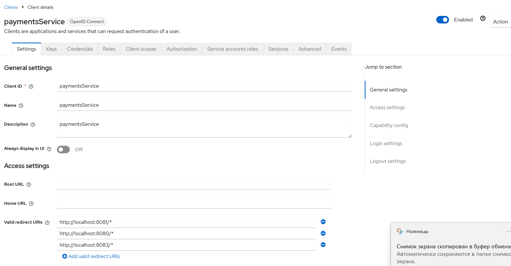
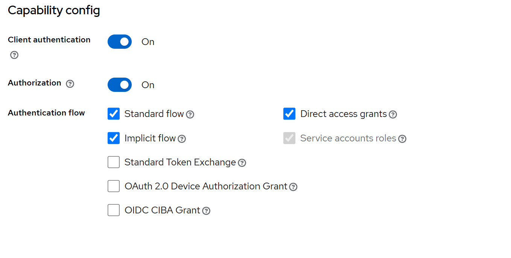

## Витрина товаров на Spring Boot

Приложение содержит пользовательский интерфейс для просмотра витрины товаров.
Каждый товар может быть просмотрен и отредактирован.
У пользователя (в данной реализации 3 пользователя и 3 соответствующих корзины) есть корзина, в которой может находиться некоторое
количество товаров. 
Их количество можно уменьшить или увеличить.
На основе корзины можно совершить заказ.
Совершение заказа реализовано как обращение к отдельному RESTful-сервису платежей. 
Взаимодействие между серверами реализовано с помощью JWT-авторизации по спецификации OAuth2.
Есть отдельная страница для просмотра заказов, на которой доступна история покупок.
Каждый пользователь имеет доступ только к своей истории заказов и к своей корзине.
Администратор может загружать новые товары в приложение с помощью CSV-импорта (описан далее)
Авторизация и аутентификация реализована с помощью Spring Security

---

### Используемые технологии:
1. ЯП: Java 21 + Фреймворк Spring Boot
2. Проект собирается с помощью системы Gradle
3. База данных - PostgreSQL + R2DBC
4. Используется контейнер Docker для запуска базы данных
5. Контейнер сервлетов Tomcat
6. Фреймворки для тестирования JUnit 5, TestContext Framework, Spring Boot Test
7. Приложение реализовано на неблокирующем стеке с использованием технологии WebFlux, R2DBC
8. Приложение реализовано как мультипроект Gradle с двумя сервисами - сервис платежей и сервис магазина
9. Взаимодействие сервисов описано в спецификации по стандарту openApi (файл .yaml)  
10. Развертывание схемы базы данных и контроль ее версионности реализован с помощью Liquibase
11. Приложение кеширует данные, к которым наиболее часто обращаются пользователи с помощью СУБД Redis
12. Безопасность приложения организована с помощью Spring Security - пароли пользователь хранятся в хешированном виде, что предотвращает утечку данных при перехвате базы
13. Backend-сервисы защищены с помощью OAuth2 на основе передачи JWT-токена

---

## Функциональность

Веб-приложение представляет собой витрину товаров, которые пользователь может положить в корзину и купить.

Приложение состоит из шести основных частей (модулей): страница витрины товаров, доступных для просмотра и покупки; страница товара; страница корзины покупателя; страница всех заказов; страница заказа; сервис покупки.
Страница витрины товаров — это веб-страница (html + javascript), на которой представлены:
1) список товаров, доступных для заказа (картинка, название, цена, кнопка добавления в корзину/удаления из неё, кнопка изменения количества товара в корзине);
2) есть пагинация (по 10, 20, 50, 100 товаров);
3) сверху строка поиска с фильтрацией по названию;
4) сверху доступна фильтрация по цене, алфавиту.

5) При нажатии на товар происходит переход на веб-страницу карточки товара, на которой представлены 
название, картинка, описание товара, возможность положить товар в корзину/удалить его, изменить количество в корзине,
цена товара.
6) В правом верхнем углу любой веб-страницы есть кнопка перехода в корзину, которая представляет собой:
веб-страницу со списком положенных в неё товаров, их количеством, ценой каждого товара и общей ценой всей корзины;
есть возможность удалить товар из корзины, изменить его количество;
есть кнопка оформления заказа.
7) В правом верхнем углу любой веб-страницы есть кнопка перехода на страницу заказов, которая представляет собой:
веб-страницу со списком всех оформленных заказов, суммой каждого заказа и общей суммой всех заказов;
при нажатии на заказ появляется веб-страница совершённого заказа.
8) На веб-странице заказа представлен список купленных товаров (картинка, название, цена).
9) При нажатии на кнопку оформления заказа происходит эмуляция оформления заказа, при этом происходит переход на страницу оформленного заказа.
10) Данные о товарах и корзине фиксируются в кэш с помощью Redis, кэш освобождается каждый раз, когда данные изменяются (при импорте CSV-файла с товарами/ добавлении или удалении товаров из корзины) либо по истечении таймаута
11) Есть возможность загрузки списка товаров на витрину товаров импортом из файла CSV (Формат описан ниже).

Пример файла CSV:
```csv
name,description,price,imageBase64
Iphone,Really nice telephone,160000,<Base64 код изображения>
```
Каждый из столбцов обязателен к заполнению, формат всех столбцов строковый, кроме price - price имеет числовой формат (целое или с двумя знаками после точки)
Импорт файла доступен по URL
http://localhost:8080/products/uploadCSV
---

## Аутентификация и авторизация
### В приложении зарегистрированы по умолчанию 3 пользователя:
### Рядовой пользователь john_doe с паролем 123
### Рядовой пользователь jane с паролем 123
### Администратор admin с паролем 123 - только этот пользователь обладает правом обновлять товарный ряд интернет-магазина.


## Развертывание

### Исходный код доступен после выполнения команды:

```bash
git clone https://github.com/medasumumbs/MarketplaceShowcase.git
```

### Для работы с проектом необходимо развернуть контейнер БД PostgreSQL, БД для хранения кэша Redis и KeyCloak для авторизации Oauth2
Необходимо выполнить команду в корневой папке проекта
```bash
docker-compose up -d 
```
## Необходимо сконфигурировать KeyCloak. 
Для логина в Keycloak по URL http://localhost:8083/ используются данные:
login: admin
password: 123
Далее необходимо сконфигурировать клиента со следующими настройками:


Перед сборкой необходимо подменить client secret в application.yaml для модуля marketplaceShowcase,
Иначе авторизация не будет произведена 


## Для запуска приложения необходимо выполнить сборку с помощью системы Gradle
Необходимо выполнить команду в корневой папке проекта
   ```bash
   ./gradlew.bat build
   ```
Затем приложение может быть запущено в двух терминалах как jar:
Запуск основного модуля приложения интернет-магазина:
   ```bash
   java -jar marketplaceApplication/build/libs/marketplaceApplication-0.0.1-SNAPSHOT.jar
   ```
Запуск платежного сервиса для получения данных о балансе пользователя и для запросов осуществления платежей:
   ```bash
   java -jar paymentsService/build/libs/paymentsService-0.0.1-SNAPSHOT.jar
   ```
Для запуска тестов необходимо также использовать gradle:
   ```bash
   ./gradlew.bat test
   ```
Используется порт 8081, для использования приложения необходимо перейти по URL:
http://localhost:8081/products
При этом платежный сервис доступен по порту 8080 по URL:
http://localhost:8080/api
Keycloak для настройки аутентификации Backend-сервисов доступен по Url:
http://localhost:8083/